# 源码学习笔记

## 浏览器断点调试


从左至右依次是：

* （等号）
  * 全称：pause script execution
  * 下一个断点

* （半弧箭头）step 
  * 快捷键：F10
  * 下一行

* （下箭头）step into 
  * 快捷键：F11 
  * 全称：step into next function call
  * 下一行，遇到子函数就进去继续

* （上箭头）step over
  *  快捷键：Shift + F11
  * 全称：step over next function call
  * 下一行，如果已经在函数内部，则不再进入子函数内部，在外部则，进入函数。

* （右箭头）
  * 全称：step out 
  * 快捷键：F9
  * 全称：step out of current function
  * 直接跳出当前的函数，返回父级函数

* （右粗箭头）
  * 全称：deactivate breakpoints or activate breakpoints
  * 快捷键：Ctrl + F8
  * 禁用断点/启用断点

* （圆形等号）
  * 全称：pause on execution
  * 暂停执行

### 三个step区别

* step into：单步执行，遇到子函数就进入并且继续单步执行（简而言之，进入子函数）；

* step over：在单步执行时，在函数内遇到子函数时不会进入子函数内单步执行，而是将子函数整个执行完再停止，也就是把子函数整个作为一步。在不存在子函数的情况下是和step into效果一样的（简而言之，越过子函数，但子函数会执行）。

* step out：当单步执行到子函数内时，用step out就可以执行完子函数余下部分，并返回到上一层函数。

## IDEA断点调试

[如何使用idea断点调试](https://zhuanlan.zhihu.com/p/349713534)

[IDEA--断点调试基本按钮--其他调试技巧笔记](https://blog.csdn.net/Strong_shady/article/details/121329932)

[大牛都在用的IDEA调试技巧](https://zhuanlan.zhihu.com/p/115823713)

[IDEA断点调试技巧，多张动图包教包会——这个好](https://mp.weixin.qq.com/s/YtLa7C19-UkcnkY8eSimNQ)

------

### 一. 怎么开启断点调试？

随着开发的深入，越来越觉得高效的调试方法是多么的重要了，但我们一般上来就是敲一些代码，谁会去静下心来学一些看似没什么用的调试技巧呢？但这恰恰就是新手和老手之间的区别。

断点调试是很简单的，只需要点击idea上方的小虫子，启动调试即可，如下所示。

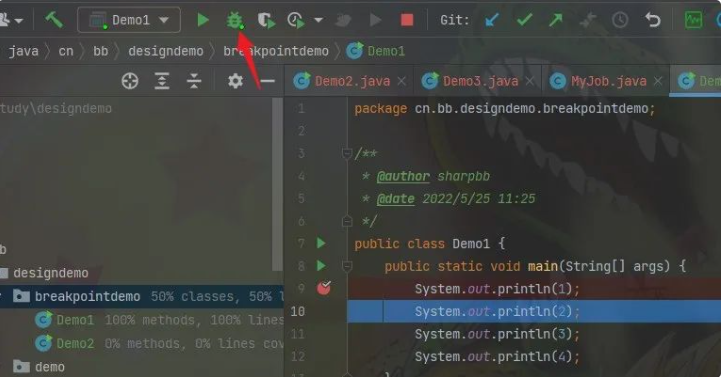

这当然不是本文的重点，只是开个头。

### 二. 调试界面咋那么多按钮？

先来介绍一下界面。

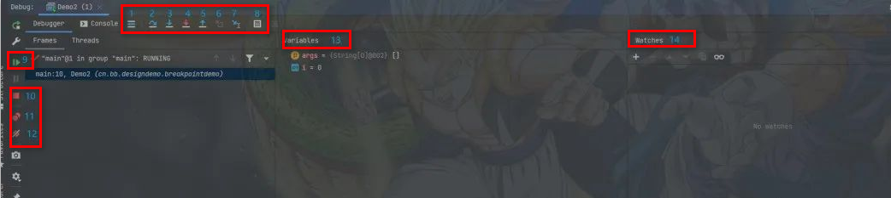

我给这些区域都标了号，下面来重点介绍。

#### 1.返回断点位置

1号按钮，这个用的不多，如果你从其他地方想要回到断点位置，就按一下即可，如下GIF所示。

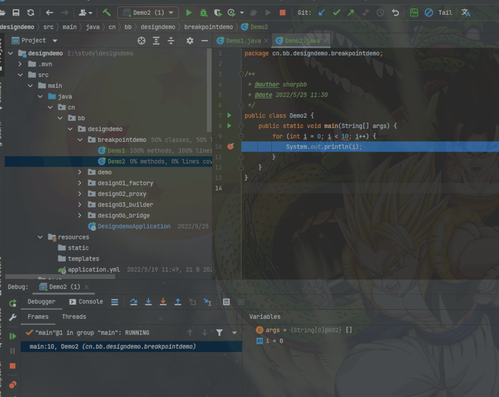

#### 2.步过

2号按钮，说人话就是一行行的往下执行，不会进入方法里面，如下所示。

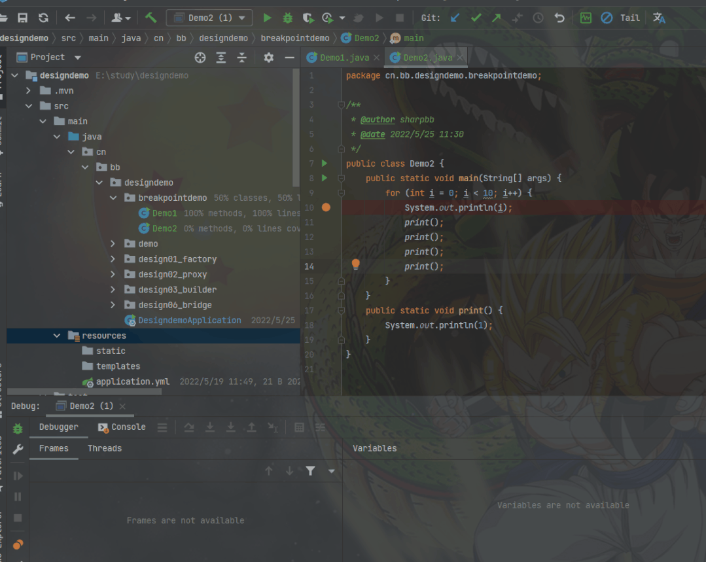

#### 3.步入

3号按钮，可以进入我们自定义的方法，如果是其他类库的方法不会进入，如下所示。

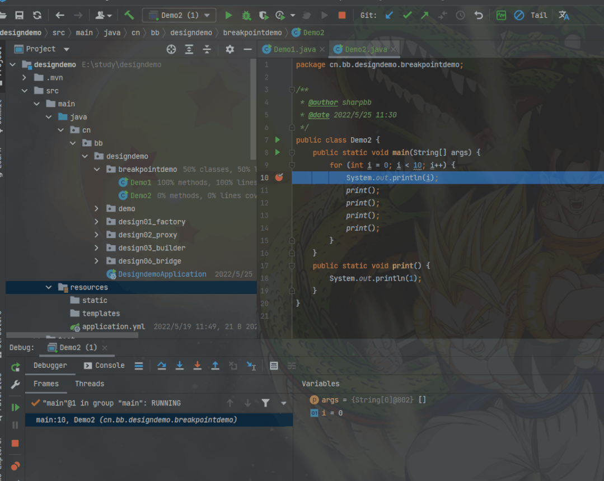

#### 4、5.强制步入，步出

4号5号按钮，前者可以进入深层的方法，包括官方的源码，后者就是从对应的方法中出来，演示如下。

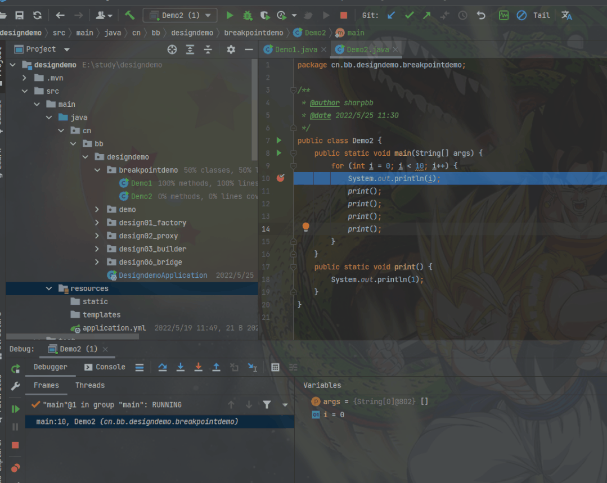

#### 6.回退断点

6号按钮是很特殊的，如果你的代码中没有调用其他地方的方法，那么是呈灰色的，无法使用，只有进入更深层的方法，才能够使用，其实就是后悔药，我们很多时候调试时不小心按的快了点，很容易错过想看的位置，只能再次重启吗？不，使用这个drop frame 就可以了，演示如下。

可以看到，这里往下执行了add，但是还没有执行完，按这个按钮，再次回到了调用方法之前，但对于数据库插入等操作，其实是无法回退的，这里的回退只是因为记录了栈信息才能够做到的。

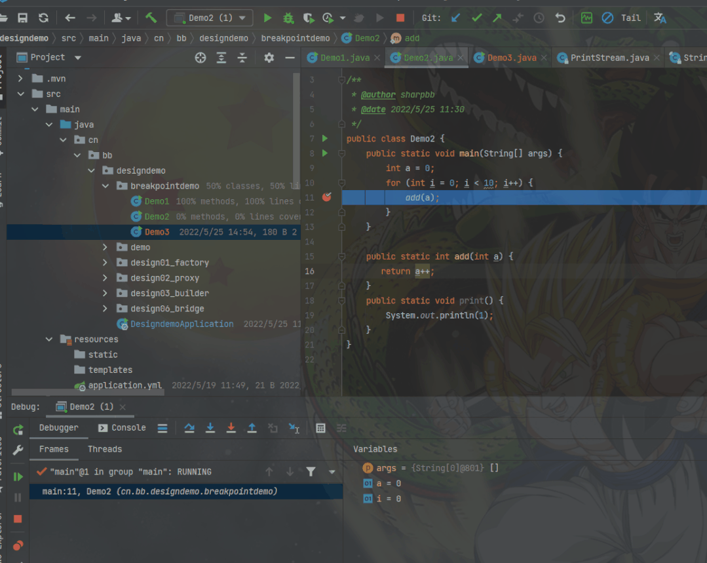

但是要注意，如果你某个方法调用完毕了，你想再回去那就没有办法了。

#### 7.断点跳到光标处

7号按钮也用的不多，主要是为了快速跳转到光标指向的那一行，如下所示。

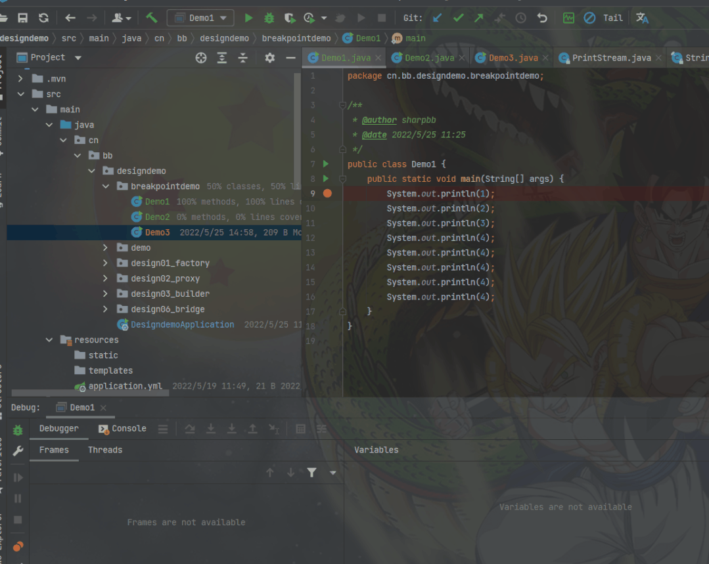

#### 8.表达式计算

8号按钮是计算表达式的，我们模拟从数据库获取集合，用表达式查询对应的元素，如下所示。

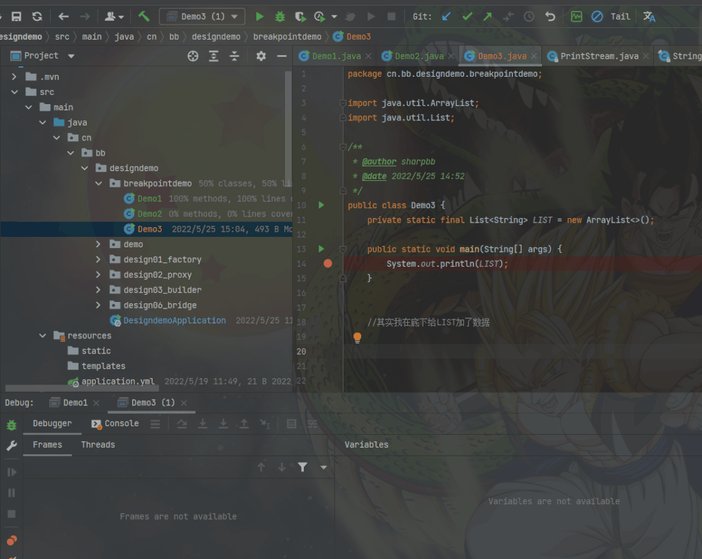

#### 9.恢复程序

>  如果下面代码没有断点，那么会执行完全部代码；如果下面有代码，那么回跳转到下面的断点。

9号按钮称为 `Resume Program`，能够跳转到指定的断点处，我们在10行和第100行各加一个断点，需要点几下该按钮跳转到100行呢？答案是一次即可，第一次断点会在第10行停下，点击改按钮直接飞越90行到第100行，如下所示。

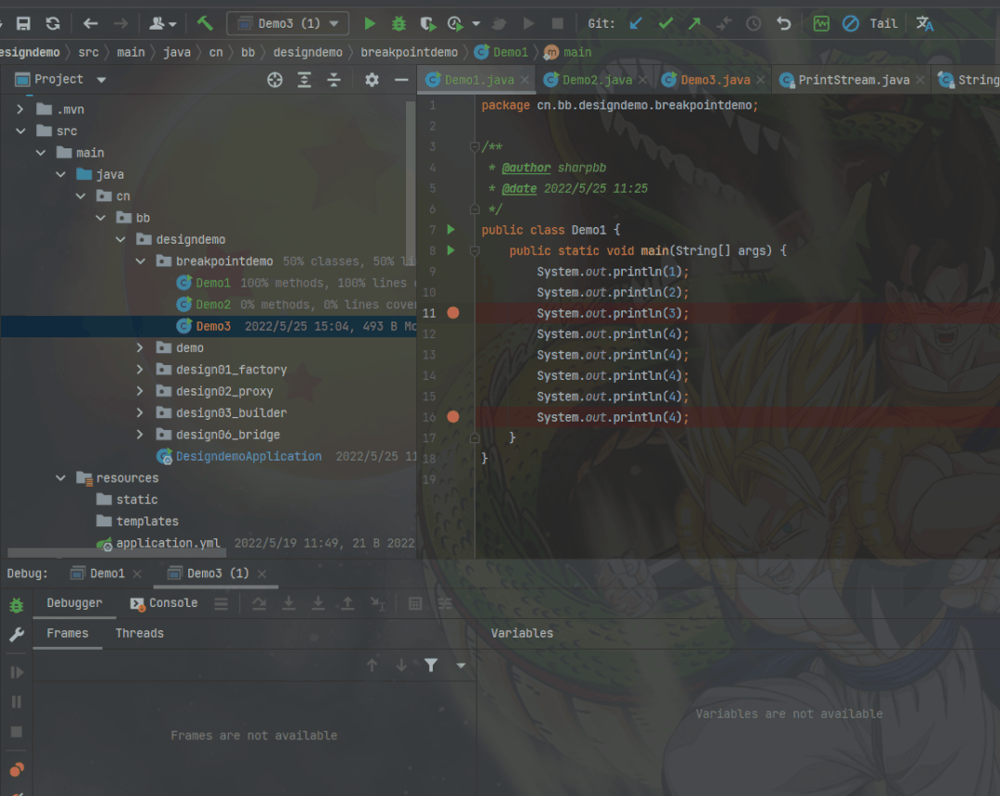

#### 10.停止程序

10号按钮就是停止调试，但是注意，即便停止了调试，程序也会继续运行下去，如何想让他就在断点处停止呢？后面我会说到。

#### 11.查看所有断点

11号按钮打开又别有乾坤，基本功能如下图所示，主要是设置，查看断点信息，大家看着应吧，实用的方法我会在下面讲的。

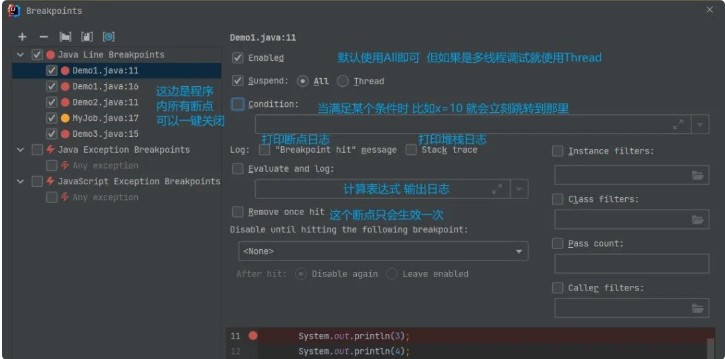

#### 12.禁用断点

12号按钮就简单了，暂时禁用掉断点，方便程序继续执行，一般配合 `Resume Program`。

#### 13.其他

13号其实不是按钮，而是一块区域，这里面存放了很多变量的信息，方便我们查看。

14号按钮其实之前被我忽略掉了，这次拿出来讲一下，在watch可以监控变量的变化，有同学说，中间的变量栏也可以看啊，但是单独拉出来，看起来更加的方便，演示如下。

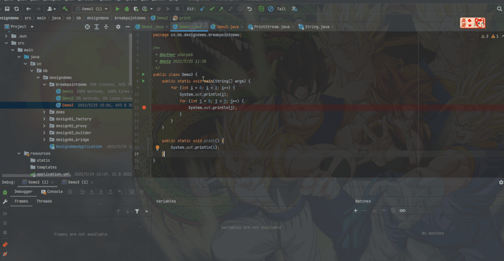

### 三. 竟然有那么多调试断点？

这里省略了普通的行断点调试，毕竟是最简单的，大家都会。

#### 1.方法断点

方法断点是不是用在普通方法上的，最好的用法是在接口上使用，当我们在调试源码的时候，如果在接口上打了断点，再往下走，可以直接跳转到实现类的实现方法上，而不需要我们一个个的去找。

案例中，有一个接口`DemoInterface`，它有两个实现类，让我们看下效果吧，演示如下。


注意，方法断点是一个菱形标志。

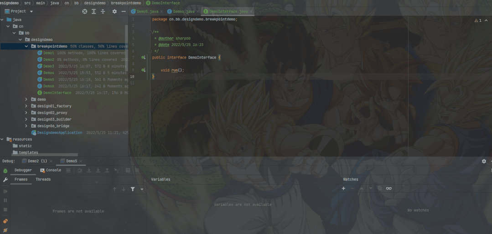

其实可以直接在接口方法上打断点，直接跳转到对应的实现方法的，这里是为了放慢演示速度。

#### 2.属性断点

属性断点是打在属性上的，我们无需再`getter setter`方法上打断点，在属性上打上断点，就会出现一个小眼睛的标志，如下所示。

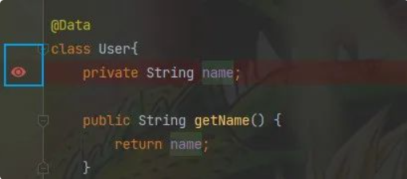

在眼睛上点击右键可以设置。

我们一般是通过getter，setter方法设值的，所以就会在这两个方法上停留。

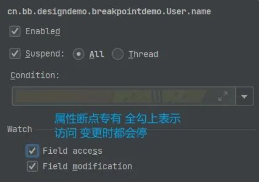

看一下GIF演示吧。

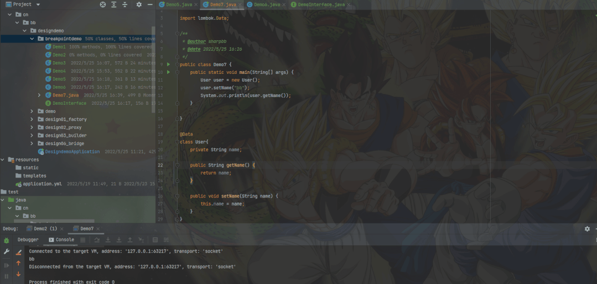

#### 3.异常断点

在线上由于空指针出现了BUG，我们想快速定位到哪里出现了空指针，应该怎么做呢，答案就是，异常断点！演示如下。


注意，异常断点是一个闪电的标志。

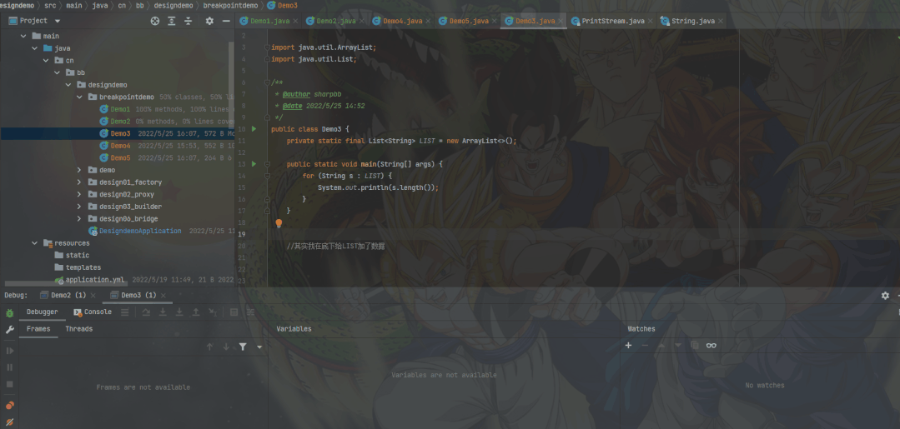

可以看到，我们在全局打了个空指针断点，只要哪里出现了空指针，就会在那里停止，太方便了！

#### 4.终止断点

前面我们说过，即便停止程序，也不会让我们后面运行的代码取消执行，那么我一定要取消执行可以吗？当然是可以的，演示如，在方法栈上点击右键，有一个`Force Return`，然后再点击`Resumer Program`，就可以直接终止返回了。


#### 5.条件断点

我想要在某个条件满足的时候打上断点，而不想一步步的走下去，有什么办法吗？当然有，在断点处右击，在`condition`里填入相应的条件即可，演示如下。

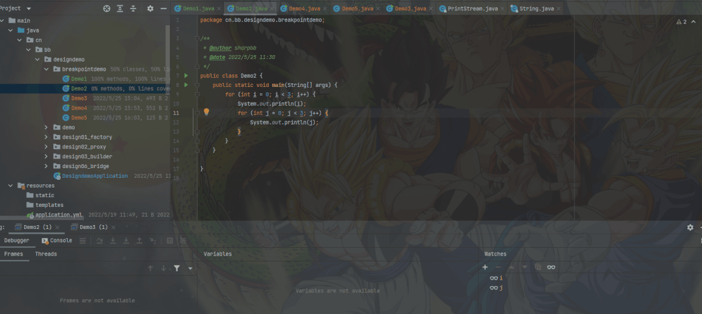

#### 6.流断点

我们使用流的时候，很难看到中间做了什么，但其实idea就帮我们解决了，我用断点调试下面代码，给大家演示下。

其实只需要找到这个按钮就行了

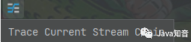

```
 List<Integer> list = new ArrayList<>(Arrays.asList(1, 3, 3, 4, 4, 4, 5, 6, 78));
        List<Integer> collect = list.stream()
          //先将偶数筛选，再去重，返回集合
                .filter(s -> s % 2 == 0)
                .distinct()
                .collect(Collectors.toList());
```

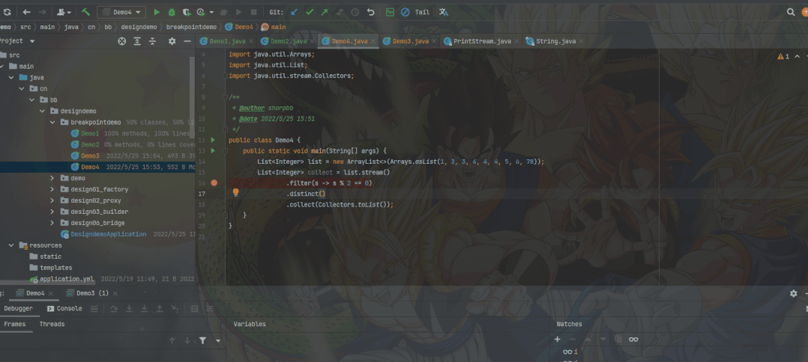

#### 7.多线程断点

给大家演示两种情况，多线程下调试，定时任务下调试。

这个演示比较简单，可能有同学不以为意，你可以去尝试下，如果使用默认All来调试多线程程序会发生什么，可能某条线程就跑掉了，没有停留，而这种方式可以捕获到运行的所有线程。


定时任务这样调试有个好处，即便我们在调试的过程中下一个任务也到时间了，也不会执行，防止多次定时任务执行带来的干扰，我在演示前已经提前一分钟启动了程序，每隔10秒钟打印一次，但是由于暂停了线程的执行，多次点击`Resumer Program`，发现并没有往下执行哦，而是再等了10秒钟之后执行。

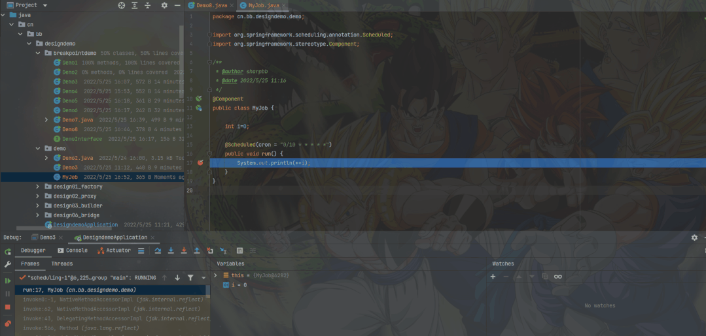

#### 8.远程断点

这个忽略啦，因为确实没有远程打过断点，有时间再补充吧，个人感觉可有可无。